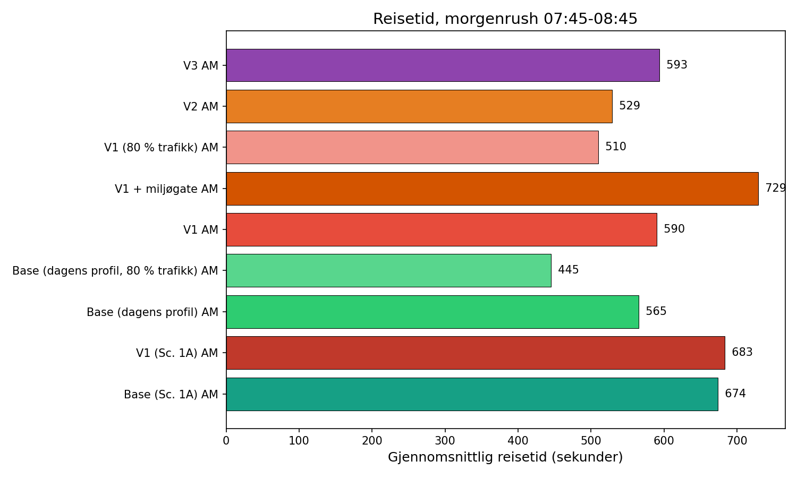
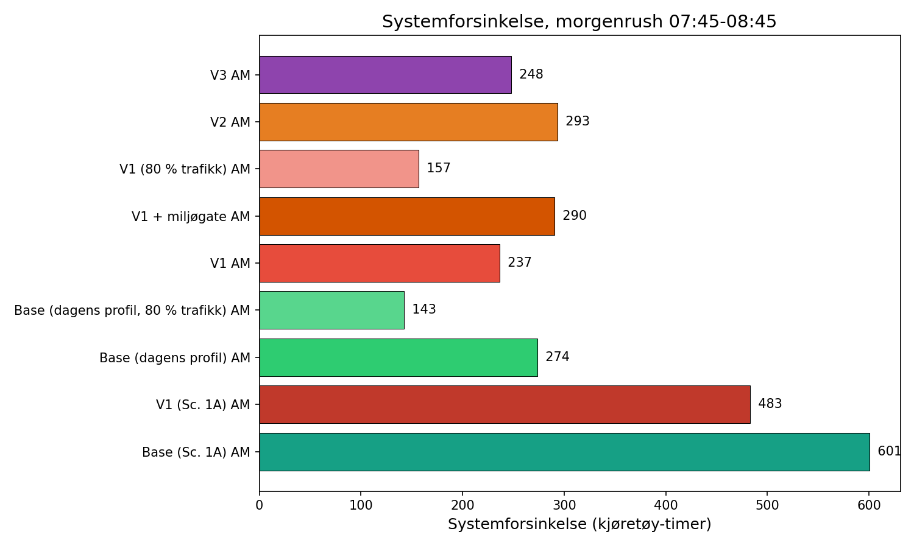
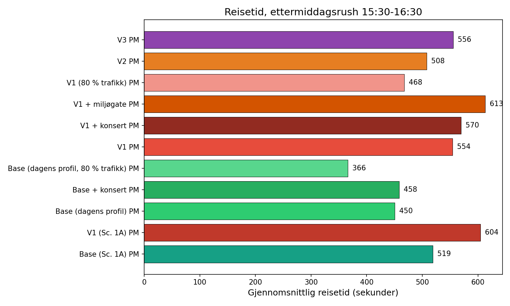
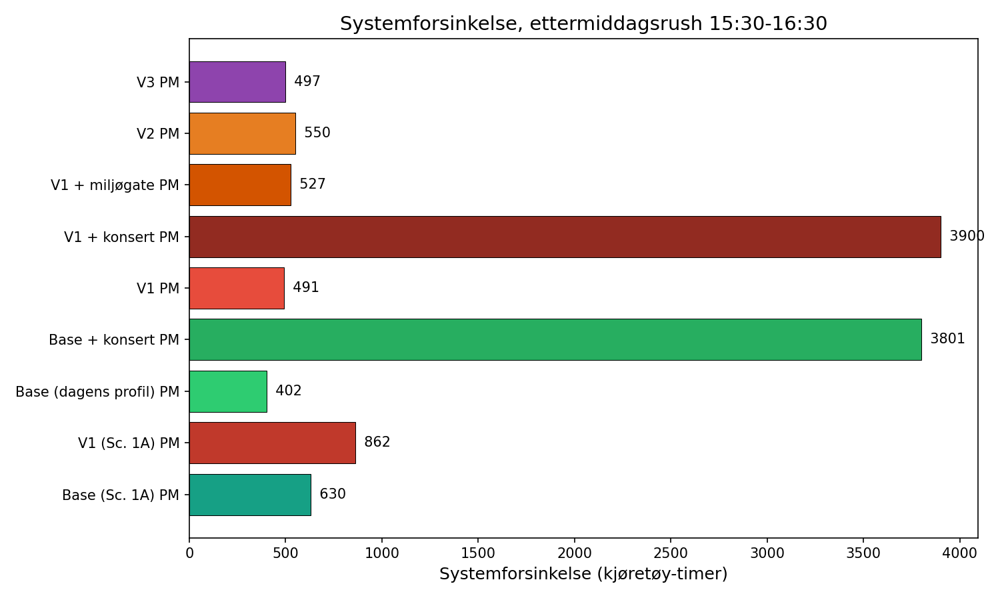

# Snarøyveien Trafikksimulering

Dette prosjektet er en åpen SUMO-simulering av trafikken på Snarøyveien og Fornebu, med særlig fokus på hva som skjer når veien forbi Flytårnet stasjon får lavere kapasitet enn tidligere.

Målet er å gjøre trafikkdiskusjonen mer etterprøvbar:

- Hvilke køer oppstår i morgen- og ettermiddagsrushet?
- Hvor mye dårligere blir framkommeligheten når veinettet strammes inn?
- Hvilke varianter ser ut til å fungere best og dårligst?

Prosjektet er laget som et uavhengig, åpent supplement til de offisielle utredningene. Det er ikke en offisiell rapport fra Bærum kommune eller Fornebubanen.

## Kort fortalt

Den siste 5-frø-kjøringen i dette repoet peker i samme retning i både morgen- og ettermiddagsrush:

- Dagens profil kommer best ut.
- Variant V1 kommer tydelig dårligere ut enn dagens profil.
- Variant V3 kommer litt bedre ut enn V1, men fortsatt dårligere enn dagens profil.
- Variant V2 kommer dårligst ut av de utredede variantene.

For scenario 4A viser de oppdaterte 5-frø-resultatene blant annet:

- Morgenrush: gjennomsnittlig reisetid øker fra 3,7 til 5,3 minutter fra base til V1.
- Morgenrush: systemforsinkelse øker fra 495,9 til 597,3 kjøretøy-timer fra base til V1.
- Ettermiddagsrush: gjennomsnittlig reisetid øker fra 3,7 til 5,2 minutter fra base til V1.
- Ettermiddagsrush: systemforsinkelse øker fra 404,3 til 490,2 kjøretøy-timer fra base til V1.

## Hva prosjektet inneholder

- Et digitalt veinett for Fornebu/Snarøya-området.
- Trafikkgrunnlag basert på OD-matriser fra vedleggene i PGF-rapporten.
- Simuleringer for både morgen- og ettermiddagsrush.
- Sammenligning av flere varianter av Snarøyveien.
- Figurer, animasjoner og en rapport som kan leses uten teknisk bakgrunn.

## Viktigste figurer

### Morgenrush: reisetid



### Morgenrush: systemforsinkelse



### Ettermiddagsrush: reisetid



### Ettermiddagsrush: systemforsinkelse



## Animasjoner og videoer

Github viser ikke alltid videofiler like pent direkte i README, så de er lenket her:

- [Side-by-side-animasjon (GIF)](output/visualizations/side_by_side.gif)
- [Side-by-side-animasjon (MP4)](output/visualizations/side_by_side.mp4)
- [Køvekst gjennom rush (GIF)](output/visualizations/queue_growth.gif)
- [Køvekst gjennom rush (MP4)](output/visualizations/queue_growth.mp4)
- [Trafikkavspilling for V1 (GIF)](output/visualizations/traffic_replay_scenario_4A_v1.gif)
- [Trafikkavspilling for V1 (MP4)](output/visualizations/traffic_replay_scenario_4A_v1.mp4)
- [Interaktivt dashboard (HTML)](output/visualizations/dashboard.html)

## Presentasjonskart

Det finnes også en egen lokal presentasjonsvisning med Kartverket-kart i bakgrunnen og SUMO-data oppå:

- Vegvariant: base, V1, V2, V3 og V1 + miljøgate
- Tidsrom: morgen, ettermiddag og et syntetisk estimat for midt på dagen
- Lag for blålyskjøretøy
- Konsertpåslag for Unity Arena
- Presentasjonskontroller for busser og fotgjengerpuljer fra T-banen

Slik starter du den:

```bash
uv run python scripts/07_export_presentation_data.py
uv run python scripts/08_serve_presentation.py
```

Åpne deretter [http://127.0.0.1:8000](http://127.0.0.1:8000).

Merk: morgen- og ettermiddagskartene bygger på reelle SUMO-kjøringer. Midt på dagen, busspåslag og fotgjengerpuljer er laget for presentasjon og utforskning, og er derfor tydelig merket som estimater i visningen.

## Les mer

Hvis du vil gå dypere enn figurene:

- Oppsummert resultatrapport: [output/report/snaroyveien_traffic_report.md](output/report/snaroyveien_traffic_report.md)
- QA-gjennomgang: [QA_REPORT.md](QA_REPORT.md)
- Tiltaksplan etter QA: [QA_REMEDIATION_PLAN.md](QA_REMEDIATION_PLAN.md)
- Plan- og faggrunnlag: [docs/](docs/)

## Viktige forbehold

Dette repoet er betydelig forbedret gjennom QA, men det finnes fortsatt begrensninger:

- Modellen er fortsatt ikke fullt kalibrert mot observerte trafikktellinger.
- Flytårnet / Bernt Balchens vei er fortsatt enklere modellert enn i en full håndbygget mikrosimulering.
- Resultatene bør derfor brukes som et åpent og etterprøvbart beslutningsstøtteverktøy, ikke som eneste grunnlag for politiske vedtak.

## For deg som bare vil se konklusjonen

Hvis du er innom repoet for å forstå saken raskt, er dette det viktigste:

1. Se figurene over.
2. Åpne [resultatrapporten](output/report/snaroyveien_traffic_report.md).
3. Sammenlign base, V1, V2 og V3.

## For deg som vil kjøre analysen selv

```bash
uv run python scripts/01_fetch_osm.py
uv run python scripts/02_build_network.py
uv run python scripts/03_generate_demand.py
uv run python scripts/04_run_simulation.py --all --seeds 5
uv run python scripts/05_analyze_results.py
uv run python scripts/06_generate_report.py
```
